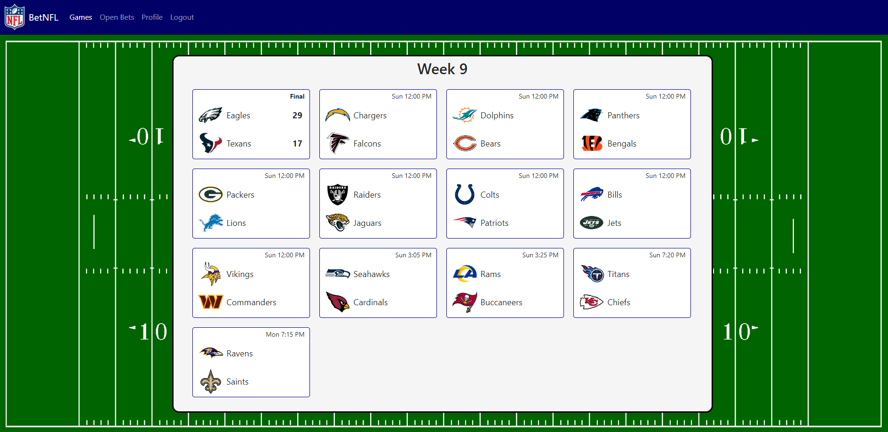
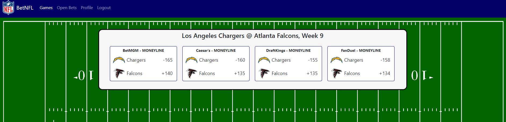
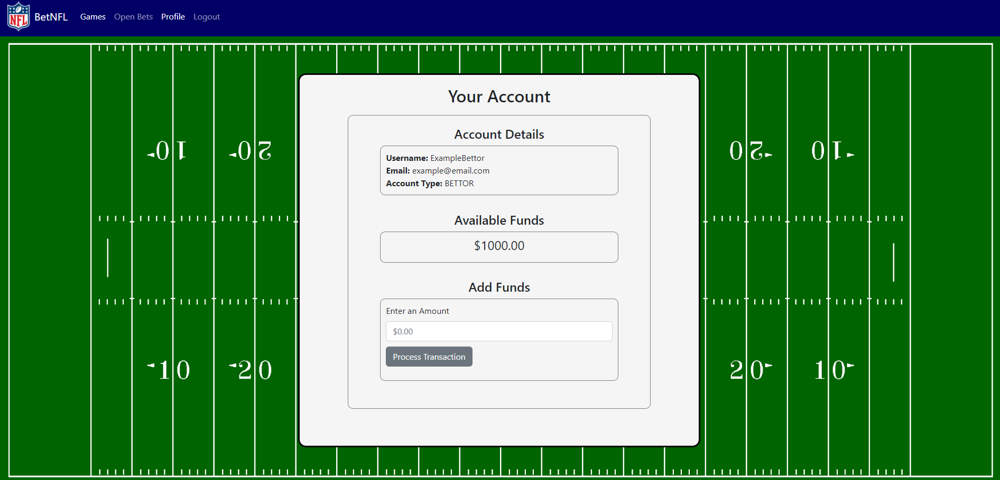
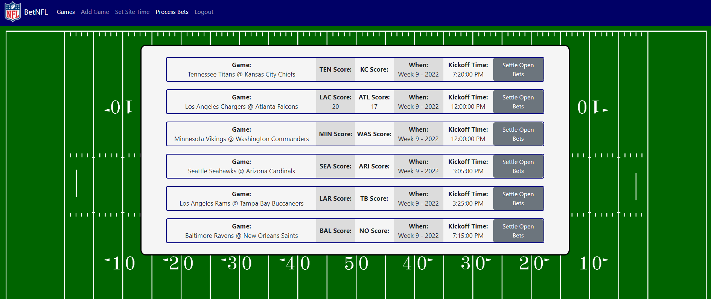
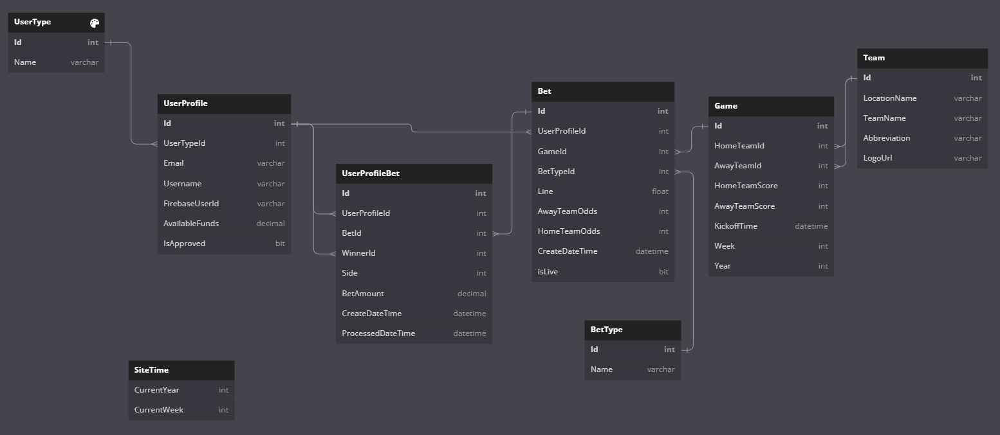

# BetNFL

## Overview

BetNFL is a sports betting website for moneyline bets on NFL games. The purpose of this site is to create a marketplace for sports betting. It provides bettors with a wide variety of sportsbooks to choose from, and it provides sportsbooks with a place to publish their odds to prospective customers. DISCLAIMER: This app was built for educational purposes, so all of the money within the app is simulated and not real.

## Features

- Three unique user experiences:
  - Bettors can select a game and place bets using the odds given by the sportsbooks
  - Sportsbook can set and adjust odds for games. These odds will be displayed to bettors for them to place bets.
  - Admins control site wide data (such as the scores of the games and the current week of games to display) and process bets once the games have been played
- Home page that displays all of the games for the current week in the NFL
- Automatic bet processing feature. With the click of a button, admins can process all bets for a game that is finished. This will update the balance of all involved bettors and sportsbooks in accordance with odds given by the sportsbook and the winner of the bet.

## Tech Stack

This is a full-stack application. The frontend is built with React, HTML, and CSS, and the backend is built with C#, .NET, and SQL Server.

## Views

### Home Page
This is the view when a bettor or sportsbook logs in to the site. A bettor can click on a game to see the odds offered by every sportsbook, and sportsbooks can click on a game to adjust their odds.

### Available Bets
As stated above, this is the view for bettors when they click on a game. Furthermore, bettors can click on one of these cards, and they will be prompted with a form to place a bet. 

### Profile
This is the profile page where bettors and sportsbooks can view their account details. Most importantly, this is where they keep track of their balance and can add funds as needed. Since this app does not use real money, all a user has to do to add funds is enter an amount and click "Process Transaction".

### Process Bets
When logged in as an admin, this view shows all the games with open bets. However, only bets on games with final scores can be processed. When clicking "Settle Open Bets", all open bets for the game will be settled, and funds will be automatically added to or subtracted from bettors and sportsbooks in accordance with the odds and winner of the bet.

### ERD

